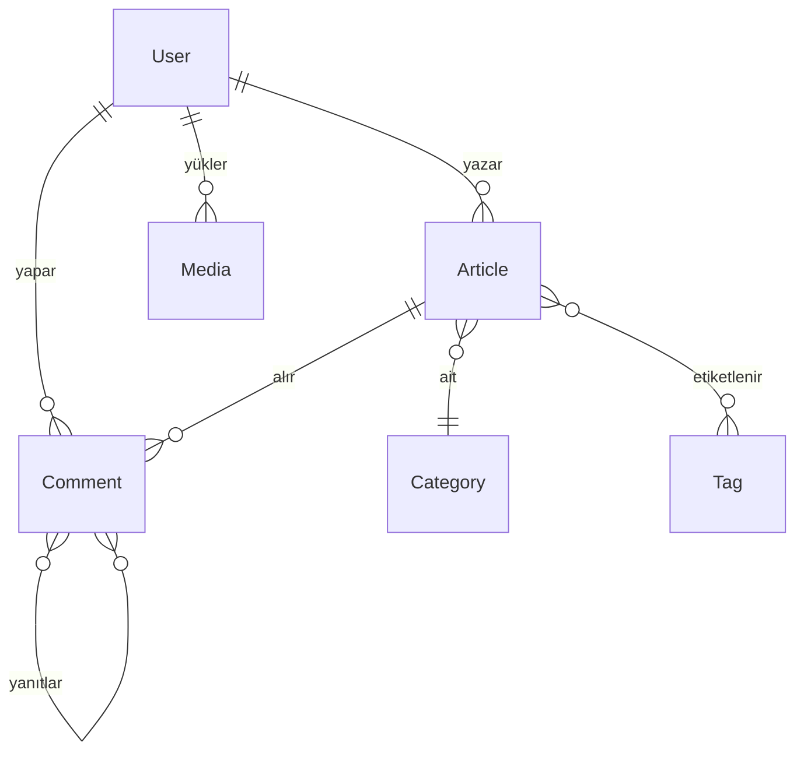

# Haber Projesi Şeması

## Proje Yapısı

```
haber/
├── cmd/                    # Komut uygulamaları
│   └── server/            # Ana API sunucusu 
│       └── main.go        # Uygulama giriş noktası
├── docs/                   # Swagger dokümantasyon dosyaları
├── internal/               # Özel paketler (dışa aktarılmaz)
│   ├── api/               # API katmanı
│   │   ├── handler/       # HTTP işleyicileri
│   │   └── middleware/    # HTTP ara yazılımları
│   ├── config/            # Uygulama yapılandırması
│   ├── domain/            # Domain modelleri (veri yapıları)
│   ├── models/            # Veritabanı modelleri (taşınma sürecinde, kaldırılabilir)
│   ├── repository/        # Veri erişim katmanı
│   ├── seed/              # Örnek veri
│   └── service/           # İş mantığı katmanı
├── migrations/             # Veritabanı şema değişiklikleri
├── pkg/                    # Paylaşılabilir kütüphaneler
│   ├── auth/              # Kimlik doğrulama yardımcıları
│   └── storage/           # Depolama yardımcıları
├── .env                    # Ortam değişkenleri
├── .gitignore              # Git tarafından yok sayılacak dosyalar
├── docker-compose.yml      # Docker kompozisyonu
├── Dockerfile              # Docker imaj tanımı
├── go.mod                  # Go modül tanımı
├── go.sum                  # Go bağımlılık sağlaması
├── LICENSE                 # Lisans bilgisi
├── Makefile                # Derleme ve geliştirme komutları
├── README.md               # Proje açıklaması
├── run.bat                 # Windows için çalıştırma betiği
└── run.sh                  # Unix için çalıştırma betiği
```

## Mimari Yapı

Bu proje, temiz mimari prensiplerine uygun şekilde tasarlanmıştır:

1. **Domain Katmanı** (`internal/domain`):
   - Veri modelleri ve varlıklar
   - İş kuralları
   - Veri transfer nesneleri (DTO'lar)

2. **Servis Katmanı** (`internal/service`):
   - İş mantığı
   - Domain modellerinin manipülasyonu

3. **Repository Katmanı** (`internal/repository`):
   - Veri erişim ve depolama
   - Veritabanı işlemleri

4. **API Katmanı** (`internal/api`):
   - HTTP işleyicileri
   - Route tanımları
   - Middleware bileşenleri

5. **Dokümantasyon Katmanı** (`docs/`):
   - Swagger API dokümantasyon dosyaları
   - API şeması ve endpoint açıklamaları

## Ana Modeller ve İlişkiler



## API Rotaları

Tüm API rotaları Swagger dokümantasyonu ile belgelenmiştir. Swagger UI'a `http://localhost:8080/swagger/` adresinden erişebilirsiniz.

### Makale Rotaları
- `GET /api/articles` - Makaleleri listele
- `GET /api/articles/:id` - Makale detayını getir
- `GET /api/articles/slug/:slug` - Slug'a göre makale getir
- `GET /api/articles/featured` - Öne çıkan makaleleri getir
- `GET /api/articles/category/:categoryID` - Kategoriye göre makaleleri getir
- `GET /api/articles/tag/:tagID` - Etikete göre makaleleri getir
- `GET /api/articles/author/:authorID` - Yazara göre makaleleri getir
- `POST /api/admin/articles` - Yeni makale oluştur (admin)
- `PUT /api/admin/articles/:id` - Makale güncelle (admin)
- `DELETE /api/admin/articles/:id` - Makale sil (admin)

### Kategori Rotaları
- `GET /api/categories` - Kategorileri listele
- `GET /api/categories/:id` - Kategori detayını getir
- `POST /api/admin/categories` - Yeni kategori oluştur (admin)
- `PUT /api/admin/categories/:id` - Kategori güncelle (admin)
- `DELETE /api/admin/categories/:id` - Kategori sil (admin)

### Etiket Rotaları
- `GET /api/tags` - Etiketleri listele
- `GET /api/tags/:id` - Etiket detayını getir
- `POST /api/admin/tags` - Yeni etiket oluştur (admin)
- `PUT /api/admin/tags/:id` - Etiket güncelle (admin)
- `DELETE /api/admin/tags/:id` - Etiket sil (admin)

### Kullanıcı Rotaları
- `GET /api/users` - Kullanıcıları listele (admin)
- `GET /api/users/:id` - Kullanıcı detayını getir
- `GET /api/users/me` - Mevcut kullanıcı bilgisini getir
- `POST /api/users` - Yeni kullanıcı oluştur (admin)
- `PUT /api/users/:id` - Kullanıcı güncelle (admin)
- `DELETE /api/users/:id` - Kullanıcı sil (admin)
- `PUT /api/users/me` - Profil güncelle
- `PUT /api/users/me/password` - Şifre değiştir

### Kimlik Doğrulama Rotaları
- `POST /api/auth/login` - Giriş yap
- `POST /api/auth/register` - Kayıt ol
- `POST /api/auth/logout` - Çıkış yap
- `POST /api/auth/refresh` - Token yenile
- `POST /api/auth/forgot-password` - Şifremi unuttum
- `POST /api/auth/reset-password` - Şifre sıfırla

### Yükleme Rotaları
- `POST /api/uploads` - Dosya yükle
- `GET /api/uploads` - Yüklenen dosyaları listele
- `DELETE /api/uploads/:id` - Dosya sil

## Kullanılan Teknolojiler ve Paketler

### Temel Framework ve Dil
- **Programlama Dili**: Go 1.23.0+
- **Web Framework**: Fiber v2.50.0 (yüksek performanslı, Express benzeri web sunucusu)
- **Kimlik Doğrulama**: JWT (JSON Web Token) v5 tabanlı
- **Hata Yönetimi**: Özel domain-specific error handling

### Veritabanı ve ORM
- **Veritabanı**: PostgreSQL 15+
- **ORM**: GORM v1.25.4 (PostgreSQL sürücüsü v1.5.2)
- **Migrasyon**: GORM yerleşik migrasyon aracı
- **Seed Verileri**: Özel init fonksiyonları

### Depolama
- **Dosya Depolama**: MinIO v7.0.89 (S3 uyumlu nesne depolama)
- **Ortam**: Docker tabanlı MinIO container

### API ve Dokümantasyon
- **API Dokümantasyonu**: Swagger UI ve Swaggo - açık API standardı
- **Fiber-Swagger Entegrasyonu**: Otomatik API dokümantasyonu için
- **Swagger Erişimi**: `http://localhost:8080/swagger/`

### Güvenlik
- **Şifreleme**: bcrypt (golang.org/x/crypto)
- **CORS Yönetimi**: Fiber yerleşik CORS middleware
- **Token Güvenliği**: JWT tabanlı access/refresh token mekanizması

### Deployment ve DevOps
- **Konteynerizasyon**: Docker ve Docker Compose
- **Derleme ve Deployment**: Makefile ile otomatikleştirilmiş işlemler
- **Ortam Değişkenleri**: `.env` dosyası ile yapılandırma

### Tasarım Desenleri ve Mimari
- **Mimari**: Temiz Mimari (Clean Architecture)
- **Katmanlı Yapı**: Domain, Service, Repository, API katmanları
- **Bağımlılık Enjeksiyonu**: Manuel (Factory Pattern)
- **Kod Organizasyonu**: Go standart modül yapısı (cmd, internal, pkg)

## API Dokümantasyonu Kullanımı

Swagger UI, projenin tüm API endpoint'lerini, parametre ve yanıt formatlarını interaktif bir şekilde belgeler. Swagger UI'a erişmek için:

1. Projeyi çalıştırın: `make run` veya `go run cmd/server/main.go`
2. Tarayıcınızda `http://localhost:8080/swagger/` adresine gidin
3. Swagger UI üzerinden API'leri keşfedin, test edin ve dökümantasyonu inceleyin

Swagger UI, aşağıdakileri sağlar:
- Tüm API endpoint'lerinin listesi
- Her endpoint için HTTP metod bilgisi (GET, POST, PUT, DELETE)
- İstek parametreleri ve body şemaları
- Yanıt kodları ve yanıt şemaları
- API'leri doğrudan tarayıcı üzerinden test etme imkanı
- Kimlik doğrulama gerektiren endpoint'ler için token giriş alanı

## İyileştirme Alanları

1. **Birim Testleri**: Servis ve repository katmanları için test eklemeleri
2. **Loglama**: Yapılandırılabilir loglama sistemi eklenmesi
3. **Önbellek**: Redis tabanlı önbellek sistemi eklenmesi
4. **Modeller Refaktörü**: `internal/models` ve `internal/domain` dizinlerindeki çakışan yapıların birleştirilmesi
5. **Daha Kapsamlı Swagger Açıklamaları**: Tüm handler'lar için Swagger açıklamalarının tamamlanması
6. **CI/CD Pipeline**: Otomatik test ve deploy için CI/CD entegrasyonu
7. **Performans İzleme**: Prometheus ve Grafana ile uygulama performansı izleme